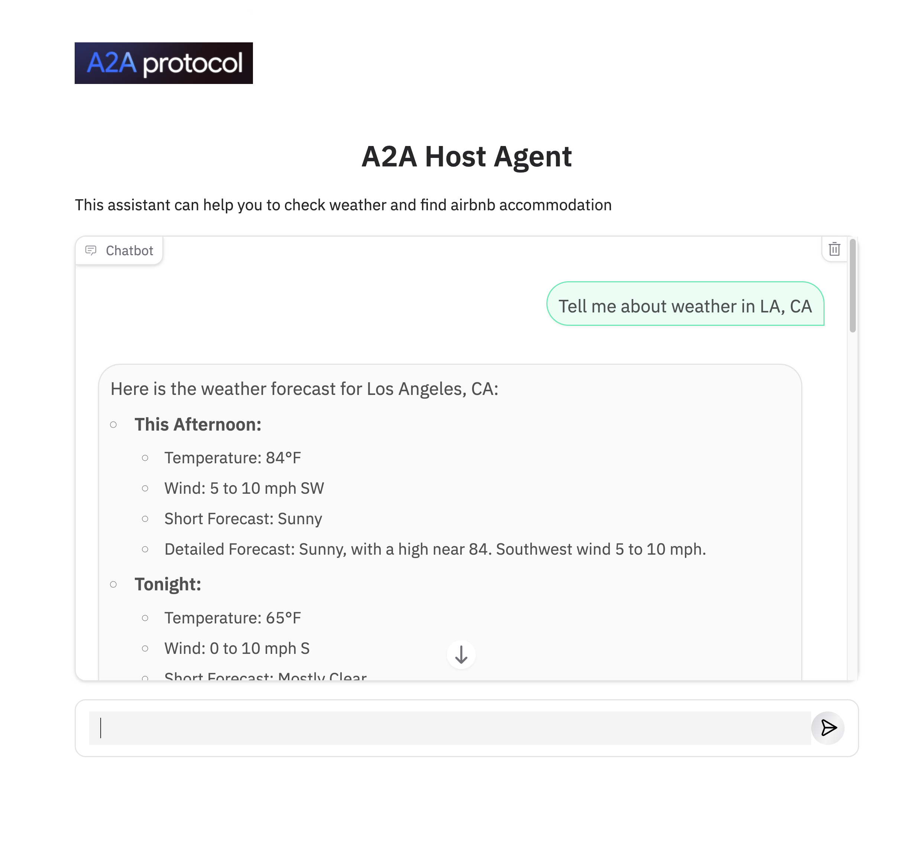

以下是内容的中文翻译：

# 使用 A2A SDK 构建 Agent

---

> *⚠️ 免责声明：本演示仅用于演示目的，不适用于生产环境。*

> *⚠️ 重要提示：A2A 仍在开发中，因此未来可能会发生与此处展示内容不同的更改。*

---

本文档介绍了一个 Web 应用程序，演示如何将 Google 的 Agent to Agent（A2A）与 Agent Development Kit（ADK）集成，以实现多智能体协调，并与 Model Context Protocol（MCP）客户端协作。该应用程序以一个主控 Agent 为核心，根据用户请求在远程 Agent 之间协调任务，这些 Agent 再分别与不同的 MCP 服务端交互来完成用户请求。

### 架构

该应用采用多智能体架构，主控 Agent 会根据用户的查询将任务分配给远程 Agent（如 Airbnb 和 Weather），这些 Agent 会进一步与相应的 MCP 服务端交互。


### 应用界面



## 安装与部署

### 前提条件

在本地运行该应用前，请确保已安装以下内容：

2. **uv：** 本项目所用的 Python 包管理工具，安装指南见：[https://docs.astral.sh/uv/getting-started/installation/](https://docs.astral.sh/uv/getting-started/installation/)
3. **Python 3.13：** 运行 a2a-sdk 所需。
4. **配置 .env 文件**

* 在 `postcode_agent` 和 `weather_agent` 文件夹中创建 `.env` 文件，内容如下，二选1即可。

```bash
GOOGLE_API_KEY=xxxx
DEEPSEEK_API_KEY=sk-f
```

* 在 `host_agent/adk_agent` 文件夹中创建 `.env` 文件，内容如下：

```bash
GOOGLE_API_KEY=xxxx
DEEPSEEK_API_KEY=sk-f
POSTCODE_AGENT_URL=http://localhost:10002
WEATHER_AGENT_URL=http://localhost:10001
```

## 1. 启动 postCode Agent 服务

运行远程服务端：

```bash
cd postcode_agent
uv run .
```

## 2. 启动天气服务

打开一个新终端，进入 `a2a-adk-app` 文件夹，运行服务：

```bash
cd weather_agent
uv run .
```

## 3. 启动主控 Agent

再打开一个新终端，运行主控服务：

```bash
cd host_agent
uv run app.py
```

## 4. 在界面上测试

以下是一些示例问题：

* “告诉我加州洛杉矶的天气”
* “告诉我加州洛杉矶的邮编”

## 参考资料

* [https://github.com/google/a2a-python](https://github.com/google/a2a-python)
* [https://codelabs.developers.google.com/intro-a2a-purchasing-concierge#1](https://codelabs.developers.google.com/intro-a2a-purchasing-concierge#1)
* [https://google.github.io/adk-docs/](https://google.github.io/adk-docs/)
